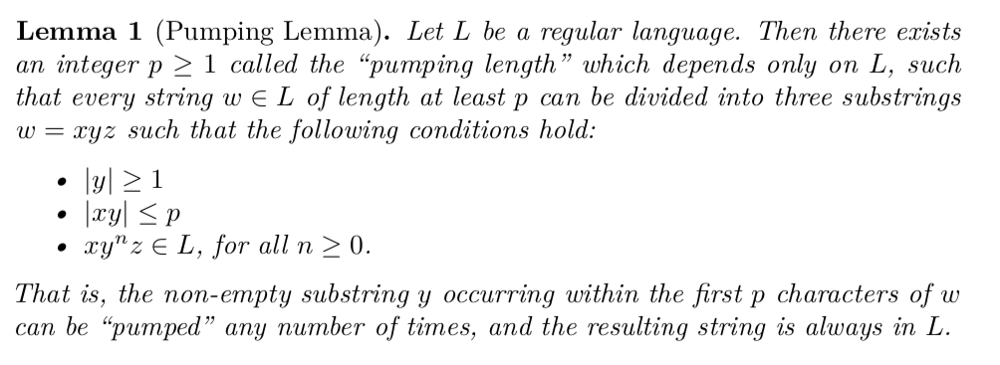
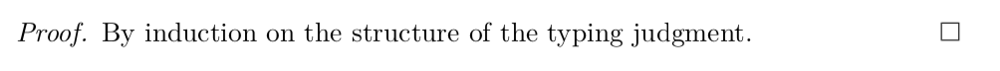
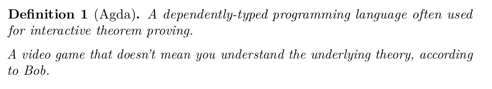
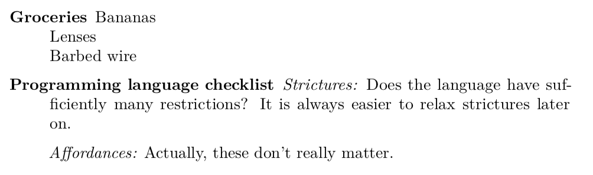

# pandoc-theorem

A [Pandoc](https://pandoc.org/) filter to convert [definition lists](https://pandoc.org/MANUAL.html#definition-lists) into [amsthm](https://www.ctan.org/pkg/amsthm) theorem environments, for compiling to PDF and LaTeX.

The extension supports the following theorem environments:

<a name="identifiers">

| Supported environment | Supported Markdown identifiers |
|-|-|
| `definition` | `Definition`, `Def` |
| `theorem` | `Theorem`, `Thm` |
| `lemma` | `Lemma` |
| `proof` | `Proof`, `Pf` |

Note that compilation targets other than PDF and LaTeX have not been tested. Notably, this includes HTML.

## Example

Given the following Markdown:

```markdown
Lemma (Pumping Lemma). \label{pumping}

:   Let $L$ be a regular language. Then there exists an integer $p \geq 1$ called the "pumping length" which depends only on $L$, such that every string $w \in L$ of length at least $p$ can be divided into three substrings $w = xyz$ such that the following conditions hold:

    - $|y| \geq 1$
    - $|xy| \leq p$
    - $xy^n z \in L$, for all $n \geq 0$.

    That is, the non-empty substring $y$ occurring within the first $p$ characters of $w$ can be "pumped" any number of times, and the resulting string is always in $L$.
```

we transform it into this PDF output:



equivalent to this LaTeX:

```latex
\begin{lemma}[Pumping Lemma] \label{lem}

Let \(L\) be a regular language. Then there exists an integer
\(p \geq 1\) called the ``pumping length'' which depends only on \(L\),
such that every string \(w \in L\) of length at least \(p\) can be
divided into three substrings \(w = xyz\) such that the following
conditions hold:

\begin{itemize}
\tightlist
\item
  \(|y| \geq 1\)
\item
  \(|xy| \leq p\)
\item
  \(xy^n z \in L\), for all \(n \geq 0\).
\end{itemize}

That is, the non-empty substring \(y\) occurring within the first \(p\)
characters of \(w\) can be ``pumped'' any number of times, and the
resulting string is always in \(L\).

\end{lemma}
```

## Usage

### Installation

You must have Pandoc installed and available in your PATH.

You can either download a prebuilt binary from the [Releases](https://github.com/sarahlim/pandoc-theorem/releases/) page, or clone and `stack install` this repository, which copies the `pandoc-theorem-exe` binary to your global Stack install location.

Check that `pandoc-theorem-exe` is in your PATH:

```
$ which pandoc-theorem-exe
/Users/slim/.local/bin/pandoc-theorem-exe # or a different path
```

### Syntax

pandoc-theorem repurposes the syntax for [definition lists](https://pandoc.org/MANUAL.html#definition-lists), checking for [recognized identifiers](#identifiers).

```markdown
Theorem (Fermat's Little).

:    If $p$ is a prime number, then for any integer $a$, the number $$a^p - a$$ is an integer multiple of $p$.
```

In general, the format looks like this:

```markdown
<term>

:    <body>
```
where `<body>` is standard Pandoc Markdown (with inline or block formatting), and `<term>` is one of the following:
```
<term> ::= <identifier>.
        |  <identifier> (<name>).
        |  <identifier> (<name>). <additional text>
```

That is, a `<term>` consists of:

- A supported environment identifier (required), followed by either
    - A period (`.`) if the environment has no name, or
    - A name in parentheses `()` which will be passed to the LaTeX environment
- Optional additional Pandoc Markdown (e.g. for LaTeX `\labels`)

Supported `<identifier>` values are [documented](#identifiers).

Confused about indentation, line spacing, or the `:` characters? Consult the documentated syntax for Pandoc [definition lists](https://pandoc.org/MANUAL.html#definition-lists).

More examples can be found in the [Examples](#examples) section below.

### Compilation

To use, pass the `pandoc-theorem-exe` executable as a filter to [Pandoc](https://pandoc.org/):

```sh
# Compile to PDF.
pandoc --filter pandoc-theorem-exe input.md -H header.tex -o output.pdf

# Output LaTeX.
pandoc --filter pandoc-theorem-exe input.md -H header.tex -t latex
```

Note that you will always need to include the following header file using Pandoc's `-H` flag:

```latex
% examples/header.tex
\usepackage{amsthm}
\newtheorem{definition}{Definition}
\newtheorem{lemma}{Lemma}
\newtheorem{theorem}{Theorem}
```

## Examples

This repository includes an example Markdown file in `examples/kitchen-sink.md`. You can explore its output using the following command:

```sh
pandoc --filter pandoc-theorem-exe examples/kitchen-sink.md -H examples/header.tex -o examples/kitchen-sink.pdf
```

### Simple block-level theorem

```markdown
Theorem (Hedberg).

:   Any type with decidable equality is a set.
```


### Complex block-level theorem

```markdown
Lemma (Pumping Lemma). \label{lem}

:   Let $L$ be a regular language. Then there exists an integer $p \geq 1$ called the "pumping length" which depends only on $L$, such that every string $w \in L$ of length at least $p$ can be divided into three substrings $w = xyz$ such that the following conditions hold:

    - $|y| \geq 1$
    - $|xy| \leq p$
    - $xy^n z \in L$, for all $n \geq 0$.

    That is, the non-empty substring $y$ occurring within the first $p$ characters of $w$ can be "pumped" any number of times, and the resulting string is always in $L$.
```


### Single inline theorem

```markdown
Proof. 
: By induction on the structure of the typing judgment.
```



### Multiple inline theorems

```markdown
Def (Coq).
:   A dependently-typed programming language often used for interactive theorem proving.
:   A video game that doesn't mean you understand the underlying theory, according to Bob.
```



### Regular definition lists still work

If you do not use 

```markdown
Groceries
: Bananas
: Lenses
: Barbed wire
```

```markdown
Programming language checklist

:     *Strictures:* Does the language have sufficiently many restrictions? It is always easier to relax strictures later on.

:     *Affordances:* Actually, these don't really matter.
```



## Acknowledgements

In addition to [John MacFarlane](https://www.johnmacfarlane.net/)'s incredible work on Pandoc itself, this filter benefited from the following prior efforts:

- [pandoc-moreblock-filter](https://github.com/NMarkgraf/pandoc-moreblock-filter/blob/master/moreblocks.hs) and [npfc](https://github.com/NMarkgraf/npfc/blob/master/moreblocks.py) by [Norman Markgraf](https://github.com/NMarkgraf)
- [defenv.py](https://github.com/01mf02/pandocfilters/blob/master/defenv.py) by [Michael Färber](https://github.com/01mf02), documented in [Pandoc filters for scientific writing](http://gedenkt.at/blog/scientific-pandoc/) and the earlier [Theorems in Pandoc](http://gedenkt.at/blog/theorems-in-pandoc/)
